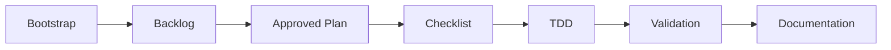

<p align="center">
  
</p>

<p align="center">
  Un esqueleto de agente para desarrollo disciplinado con <strong>OpenCode</strong>, SDD, TDD y documentos como fuente de verdad.
</p>

<p align="center">
  
  
</p>

---

## Qué Es

**Krill** es una plantilla de espacio de trabajo para agentes de desarrollo. Permite que un agente entre a un proyecto con reglas claras, tareas trazables y validación disciplinada — antes de tocar una sola línea de código de producto.

El repositorio está actualmente en **modo skeleton**: aún no hay código de producto. Está listo para ser adoptado en un proyecto existente o usado para inicializar uno nuevo mediante el flujo de trabajo de bootstrap.

## Por Qué Existe

- **Menos conjeturas** — las decisiones viven en documentos fuente de verdad, no en contexto perdido.
- **Trabajo trazable** — backlog, plan, checklist y Definition of Done para cada cambio significativo.
- **TDD por defecto** — define primero la expectativa, luego implementa y valida.
- **Agentes extensibles** — comandos y skills listos para adaptar el flujo de trabajo a cada proyecto.
- **Bootstrap seguro** — mantiene la configuración del agente separada de la implementación del producto.

## Flujo de Trabajo



1. Ejecuta el bootstrap para adaptar el agente a tu proyecto.
2. Selecciona una única tarea activa en `agents/task/backlog.md`.
3. Crea y aprueba un plan específico para la tarea.
4. Deriva un checklist ejecutable del plan.
5. Implementa con TDD y valida contra la Definition of Done.
6. Actualiza solo la documentación que cambia contratos duraderos.

## Qué Incluye

| Área | Contenido |
|---|---|
| Agent rules | `AGENTS.md` con modo, límites, flujo de trabajo SDD/TDD y mapa fuente de verdad |
| OpenCode commands | Bootstrap, commits semánticos, herramientas de prompt, README y cambios triviales rápidos |
| Tasks | Backlog, planes, checklists y archivo en `agents/task/` |
| Documentation | DoD, testing, API, DB, decisions, debt, design y dependency policy |
| Skills | TDD, code review, security, performance, SEO, UI y Context7 MCP |

## Comandos

| Comando | Propósito |
|---|---|
| [`/bootstrap`](.opencode/commands/bootstrap.md) | Adoptar el skeleton en un proyecto existente y preparar la transición al modo proyecto |
| [`/commit`](.opencode/commands/commit.md) | Agrupar cambios en commits semánticos y hacer push |
| [`/fast`](.opencode/commands/skip-sdd-tdd.md) | Implementación rápida de cambios triviales no conductuales (omite SDD/TDD) |
| [`/prompt`](.opencode/commands/prompt.md) | Convertir una solicitud preliminar en un prompt optimizado (solo salida, sin ejecución) |
| [`/prompt-run`](.opencode/commands/prompt-run.md) | Convertir una solicitud preliminar en un prompt optimizado y ejecutarlo |
| [`/readme`](.opencode/commands/readme.md) | Regenerar el README desde el estado real del proyecto |

## Requisitos

- [OpenCode](https://opencode.ai) — el skeleton está diseñado alrededor de sus comandos, agentes y configuración.
- Context7 MCP — requerido si quieres usar la skill `context7-mcp` para documentación actualizada de librerías, SDKs y frameworks.

## Instalación

Clona el repositorio en la raíz del espacio de trabajo donde quieras preparar el agente:

```bash
git clone https://github.com/rubpergar/krill.git
cd krill
```

Para adoptar el skeleton en un **proyecto existente**:

```text
/bootstrap
```

Si estás comenzando un **nuevo proyecto** sin código aún, sigue la ruta incremental descrita en [`agents/docs/bootstrap.md`](agents/docs/bootstrap.md).

## Estructura

```text
krill/
├── .opencode/
│   └── commands/        # Custom OpenCode commands
├── agents/              # Source-of-truth docs, tasks, DB, and agent skills
├── assets/              # README images and resources
├── AGENTS.md            # Main operating rules
├── LICENSE              # MIT license
├── README.md            # Project presentation
└── skills-lock.json     # Skill provenance and integrity hashes
```

## Estado Actual

- Modo: `skeleton`.
- Aún no hay stack de producto configurado.
- No hay comandos install, test, lint, typecheck ni build definidos para el código de producto.
- La implementación de funcionalidades está bloqueada hasta que el bootstrap esté completo y el repositorio transicione a `modo proyecto`.

## Contribuciones

Este es un esqueleto de agente privado. Si lo reutilizas, adapta primero los documentos fuente de verdad a tu proyecto y evita introducir código de producto hasta que el bootstrap esté terminado.

## Licencia

MIT. Consulta [`LICENSE`](LICENSE) para más detalles.
