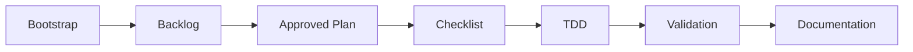

<p align="center">
  
</p>

<p align="center">
  An agent skeleton for disciplined development with <strong>OpenCode</strong>, SDD, TDD, and docs as source of truth.
</p>

<p align="center">
  
  
</p>

---

## What It Is

**Krill** is a workspace template for development agents. It enables an agent to step into a project with clear rules, traceable tasks, and disciplined validation — before touching a single line of product code.

The repository is currently in **skeleton mode**: no product code yet. It is ready to be adopted into an existing project or used to initialize a new one through the bootstrap workflow.

## Why It Exists

- **Less guesswork** — decisions live in source-of-truth docs, not lost context.
- **Traceable work** — backlog, plan, checklist, and Definition of Done for every meaningful change.
- **TDD by default** — define the expectation first, then implement and validate.
- **Extensible agents** — commands and skills ready to adapt the workflow to each project.
- **Safe bootstrap** — keeps agent setup separate from product implementation.

## Workflow



1. Run bootstrap to adapt the agent to your project.
2. Select a single active task in `agents/task/backlog.md`.
3. Create and approve a task-specific plan.
4. Derive an executable checklist from the plan.
5. Implement with TDD and validate against the Definition of Done.
6. Update only the documentation that changes durable contracts.

## What's Included

| Area | Contents |
|---|---|
| Agent rules | `AGENTS.md` with mode, boundaries, SDD/TDD workflow, and source-of-truth map |
| OpenCode commands | Bootstrap, semantic commits, prompt tools, README, and fast-track trivial changes |
| Tasks | Backlog, plans, checklists, and archive under `agents/task/` |
| Documentation | DoD, testing, API, DB, decisions, debt, design, and dependency policy |
| Skills | TDD, code review, security, performance, SEO, UI, and Context7 MCP |

## Commands

| Command | Purpose |
|---|---|
| [`/bootstrap`](.opencode/commands/bootstrap.md) | Adopt the skeleton into an existing project and prepare transition to project mode |
| [`/commit`](.opencode/commands/commit.md) | Group changes into semantic commits and push |
| [`/fast`](.opencode/commands/skip-sdd-tdd.md) | Quick implementation of trivial, non-behavioral changes (bypasses SDD/TDD) |
| [`/prompt`](.opencode/commands/prompt.md) | Convert a rough request into an optimized prompt (output only, no execution) |
| [`/prompt-run`](.opencode/commands/prompt-run.md) | Convert a rough request into an optimized prompt and execute it |
| [`/readme`](.opencode/commands/readme.md) | Regenerate the README from the actual project state |

## Requirements

- [OpenCode](https://opencode.ai) — the skeleton is designed around its commands, agents, and configuration.
- Context7 MCP — required if you want to use the `context7-mcp` skill for up-to-date library, SDK, and framework documentation.
- Node.js — needed if you want to validate `agents/docs/design.md` with `npx @google/design.md lint agents/docs/design.md` during bootstrap or later UI documentation updates.

## Installation

Clone the repository at the root of the workspace where you want to prepare the agent:

```bash
git clone https://github.com/rubpergar/krill.git
cd krill
```

To adopt the skeleton into an **existing project**:

```text
/bootstrap
```

If you are starting a **new project** with no code yet, follow the incremental path described in [`agents/docs/bootstrap.md`](agents/docs/bootstrap.md).

## Structure

```text
krill/
├── .opencode/
│   └── commands/        # Custom OpenCode commands
├── agents/              # Source-of-truth docs, tasks, DB, and agent skills
├── assets/              # README images and resources
├── AGENTS.md            # Main operating rules
├── LICENSE              # MIT license
├── README.md            # Project presentation
└── skills-lock.json     # Skill provenance and integrity hashes
```

## Current Status

- Mode: `skeleton`.
- No product stack configured yet.
- No install, test, lint, typecheck, or build commands defined for product code.
- Feature implementation is blocked until bootstrap is complete and the repo transitions to `project mode`.

## Contributing

This is a private agent skeleton. If you reuse it, adapt the source-of-truth docs to your project first, and avoid introducing product code until bootstrap is finished.

## License

MIT. See [`LICENSE`](LICENSE) for details.
