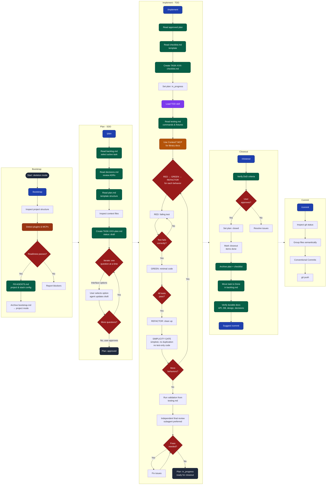

<p align="center">
  
</p>

<p align="center">
  Un esqueleto de agente para desarrollo disciplinado con <strong>OpenCode</strong>, SDD, TDD y documentación como fuente de verdad.
</p>

<p align="center">
  
  
</p>

---

## Qué Es

**Krill** es una plantilla de espacio de trabajo para agentes de desarrollo. Permite que un agente entre en un proyecto con reglas claras, tareas trazables y validación disciplinada — antes de tocar una sola línea de código de producto.

El repositorio está actualmente en **modo esqueleto**: aún no hay código de producto. Está listo para ser adoptado en un proyecto existente o utilizado para inicializar uno nuevo mediante el flujo de arranque.

## Flujo de Trabajo

<details>
<summary>Flujo de trabajo completo</summary>


```mermaid
flowchart LR
    classDef cmd fill:#1e40af,color:#fff,stroke:#1e3a8a,stroke-width:2px,rx:8,ry:8
    classDef file fill:#065f46,color:#fff,stroke:#064e3b,stroke-width:2px,rx:8,ry:8
    classDef skill fill:#7c3aed,color:#fff,stroke:#6d28d9,stroke-width:2px,rx:8,ry:8
    classDef mcp fill:#b45309,color:#fff,stroke:#92400e,stroke-width:2px,rx:8,ry:8
    classDef plugin fill:#9a3412,color:#fff,stroke:#7c2d12,stroke-width:2px,rx:8,ry:8
    classDef state fill:#1e293b,color:#fff,stroke:#0f172a,stroke-width:2px,rx:8,ry:8
    classDef decision fill:#991b1b,color:#fff,stroke:#7f1d1d,stroke-width:2px,rx:8,ry:8

    L1(Command):::cmd ~~~ L2(File / Doc):::file ~~~ L3(Skill):::skill ~~~ L4(MCP):::mcp ~~~ L5(Plugin):::plugin ~~~ L6(State):::state ~~~ L7(Decision):::decision
```


```mermaid
flowchart LR
    %% ==================== STYLES ====================
    classDef cmd fill:#1e40af,color:#fff,stroke:#1e3a8a,stroke-width:2px,rx:8,ry:8
    classDef file fill:#065f46,color:#fff,stroke:#064e3b,stroke-width:2px,rx:8,ry:8
    classDef skill fill:#7c3aed,color:#fff,stroke:#6d28d9,stroke-width:2px,rx:8,ry:8
    classDef mcp fill:#b45309,color:#fff,stroke:#92400e,stroke-width:2px,rx:8,ry:8
    classDef plugin fill:#9a3412,color:#fff,stroke:#7c2d12,stroke-width:2px,rx:8,ry:8
    classDef state fill:#1e293b,color:#fff,stroke:#0f172a,stroke-width:2px,rx:8,ry:8
    classDef decision fill:#991b1b,color:#fff,stroke:#7f1d1d,stroke-width:2px,rx:8,ry:8

    %% ==================== BOOTSTRAP ====================
    subgraph B[Bootstrap]
        direction TB
        B0([Start: skeleton mode]):::state --> B1["/bootstrap"]:::cmd
        B1 --> B2["Inspect project structure"]
        B2 --> B3["Detect plugins & MCPs"]:::plugin
        B3 --> B4{"Readiness passes?"}:::decision
        B4 -- Yes --> B5["Fill AGENTS.md\nproject & stack config"]:::file
        B5 --> B6["Archive bootstrap.md\n→ project mode"]
        B4 -- No --> B7["Report blockers"]
    end

    %% ==================== PLAN ====================
    subgraph S[Plan - SDD]
        direction TB
        S1["/plan"]:::cmd
        S1 --> S2["Read backlog.md\nselect active task"]:::file
        S2 --> S3["Read decisions.md\nreview ADRs"]:::file
        S3 --> S4["Read plan.md\ntemplate structure"]:::file
        S4 --> S5["Inspect context files"]
        S5 --> S6["Create TASK-XXX-plan.md\nstatus: draft"]:::file
        S6 --> S7{"Iterate: one\nquestion at a time"}:::decision
        S7 -- "Interface options" --> S8["User selects option\nagent updates draft"]
        S8 --> S9{"More questions?"}:::decision
        S9 -- Yes --> S7
        S9 -- "No, user approves" --> S10(Plan: approved):::state
    end

    %% ==================== IMPLEMENT ====================
    subgraph T[Implement - TDD]
        direction TB
        T1["/implement"]:::cmd
        T1 --> T2["Read approved plan"]:::file
        T2 --> T3["Read checklist.md\ntemplate"]:::file
        T3 --> T4["Create TASK-XXX-checklist.md"]:::file
        T4 --> T5["Set plan: in_progress"]
        T5 --> T6["Load TDD skill"]:::skill
        T6 --> T7["Read testing.md\ncommands & fixtures"]:::file
        T7 --> T8["Use Context7 MCP\nfor library docs"]:::mcp
        T8 --> T9{"RED → GREEN → REFACTOR\nfor each behavior"}:::decision
        T9 --> T10["RED: failing test"]
        T10 --> T11{"Test fails\ncorrectly?"}:::decision
        T11 -- Yes --> T12["GREEN: minimal code"]
        T11 -- No --> T10
        T12 --> T13{"All tests\npass?"}:::decision
        T13 -- Yes --> T14["REFACTOR: clean up"]
        T14 --> T15["SIMPLICITY GATE\nsimplest, no duplication\nno test-only code"]
        T15 --> T16{"More\nbehaviors?"}:::decision
        T16 -- Yes --> T9
        T16 -- No --> T17["Run validation from\ntesting.md"]
        T17 --> T18["Independent final review\nsubagent preferred"]
        T18 --> T19{"Fixes\nneeded?"}:::decision
        T19 -- Yes --> T20["Fix issues"]
        T20 --> T19
        T19 -- No --> T21["Plan: in_progress\nready for closeout"]:::state
    end

    %% ==================== CLOSEOUT ====================
    subgraph C[Closeout]
        direction TB
        C1["/closeout"]:::cmd
        C1 --> C2["Verify DoD criteria"]:::file
        C2 --> C3{"User\napproves?"}:::decision
        C3 -- Yes --> C4["Set plan: closed"]
        C4 --> C5["Mark closeout\nitems done"]
        C5 --> C6["Archive plan + checklist"]:::file
        C6 --> C7["Move task to Done\nin backlog.md"]:::file
        C7 --> C8["Verify durable docs\nAPI, DB, design, decisions"]:::file
        C3 -- No --> C9["Resolve issues"]
        C8 --> C10["Suggest /commit"]:::cmd
    end

    %% ==================== COMMIT ====================
    subgraph D[Commit]
        direction TB
        D0["/commit"]:::cmd --> D1["Inspect git status"]
        D1 --> D2["Group files semantically"]
        D2 --> D3["Conventional Commits"]
        D3 --> D4["git push"]
    end

    %% ==================== CROSS-PHASE ====================
    B -.-> S
    S -.-> T
    T -.-> C
    C -.-> D
```

</details>

## Qué Incluye

| Área | Contenidos |
|---|---|
| Reglas del agente | `AGENTS.md` con modo, límites, flujo SDD/TDD y mapa de fuentes de verdad |
| Comandos OpenCode | Arranque, planificación, implementación, cierre, pruebas, commits semánticos, herramientas de prompt, README y ruta rápida para cambios triviales |
| Tareas | Backlog, planes, listas de verificación y archivo bajo `agents/task/` |
| Documentación | DoD, pruebas, API, DB, decisiones, deuda, diseño y política de dependencias |
| Skills | TDD, revisión de código, seguridad, rendimiento, SEO, UI, Context7 MCP y descubrimiento de skills |

## Comandos

| Comando | Propósito |
|---|---|
| [`/bootstrap`](.opencode/commands/bootstrap.md) | Adoptar el esqueleto en un proyecto existente y preparar la transición a modo proyecto |
| [`/plan`](.opencode/commands/plan.md) | Crear o refinar el plan de la tarea activa a partir del contexto de la conversación |
| [`/implement`](.opencode/commands/implement.md) | Generar la lista de verificación y ejecutar la tarea aprobada con TDD |
| [`/closeout`](.opencode/commands/closeout.md) | Cerrar la tarea activa, archivar archivos de tarea y finalizar documentos duraderos |
| [`/test`](.opencode/commands/test.md) | Auto-descubrir superficie de prueba, ampliar cobertura y validar cambios de prueba |
| [`/commit`](.opencode/commands/commit.md) | Agrupar cambios en commits semánticos y hacer push |
| [`/skip-sdd-tdd`](.opencode/commands/skip-sdd-tdd.md) | Implementación rápida de cambios triviales sin comportamiento (omite SDD/TDD) |
| [`/prompt`](.opencode/commands/prompt.md) | Convertir una solicitud aproximada en un prompt optimizado (solo salida, sin ejecución) |
| [`/prompt-run`](.opencode/commands/prompt-run.md) | Convertir una solicitud aproximada en un prompt optimizado y ejecutarlo |
| [`/readme`](.opencode/commands/readme.md) | Regenerar el README desde el estado real del proyecto |

## Requisitos

- [OpenCode](https://opencode.ai) — el esqueleto está diseñado en torno a sus comandos, agentes y configuración.
- Context7 MCP — necesario si quieres usar la skill `context7-mcp` para documentación actualizada de librerías, SDKs y frameworks.

## Integraciones Opcionales

Úsalas solo cuando mejoren materialmente el proyecto usando `Krill`.

| Complemento | Tipo | Útil para |
|---|---|---|
| Context7 | MCP | Documentación actualizada de librerías, frameworks, SDKs, CLIs y servicios cloud |
| Playwright | MCP | Automatización de navegador, validación de UI, flujos E2E |
| `opencode-pty` | Plugin | Mejor manejo de terminal/sesión para flujos con muchos comandos |
| `opencode-vibeguard` | Plugin | Barrera extra de calidad/gobernanza contra ejecución descuidada del agente |

Configúralos en la configuración de OpenCode del proyecto consumidor solo si ese proyecto se beneficia de ellos.

## Instalación

Clona el repositorio en la raíz del espacio de trabajo donde quieras preparar el agente:

```bash
git clone https://github.com/rubpergar/krill.git
cd krill
```

Para adoptar el esqueleto en un **proyecto existente**:

```bash
/bootstrap
```

Si estás comenzando un **nuevo proyecto** sin código aún, sigue la ruta incremental descrita en [`agents/docs/bootstrap.md`](agents/docs/bootstrap.md).

## Estructura

```text
krill/
├── .opencode/
│   └── commands/        # Comandos personalizados de OpenCode
├── agents/              # Documentos fuente de verdad, tareas, DB y skills de agente
├── AGENTS.md            # Reglas operativas principales
├── LICENSE              # Licencia MIT
├── README.md            # Presentación del proyecto
└── skills-lock.json     # Hashes de procedencia e integridad de skills
```

## Estado Actual

- Modo: `skeleton`.
- Aún no hay stack de producto configurado.
- No hay comandos de instalación, prueba, lint, typecheck ni build definidos para el código de producto.
- La implementación de funcionalidades está bloqueada hasta que el arranque esté completo y el repositorio transicione a `modo proyecto`.

## Contribuir

Este es un esqueleto de agente privado. Si lo reutilizas, adapta primero los documentos fuente de verdad a tu proyecto y evita introducir código de producto hasta que el arranque haya finalizado.

## Licencia

MIT. Consulta [`LICENSE`](LICENSE) para más detalles.
