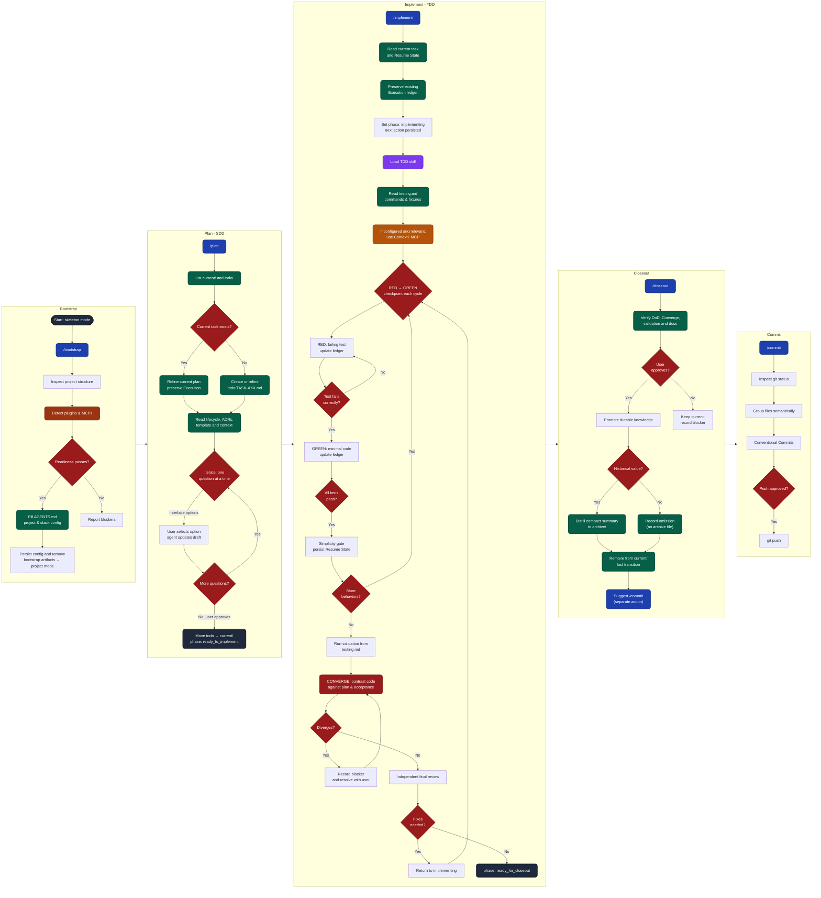

<p align="center">
  
</p>

<p align="center">
  An agent skeleton for disciplined development with <strong>OpenCode</strong>, SDD, TDD, and docs as source of truth.
</p>

<p align="center">
  
  
</p>

---

## What It Is

**Krill** is a workspace template for development agents. It enables an agent to step into a project with clear rules, traceable tasks, and disciplined validation before touching a single line of product code.

The repository is currently in **skeleton mode**: no product code yet. It is ready to be adopted into an existing project or used to initialize a new one through the bootstrap workflow.

## Workflow

<details>
<summary>Full workflow</summary>


```mermaid
flowchart LR
    classDef cmd fill:#1e40af,color:#fff,stroke:#1e3a8a,stroke-width:2px,rx:8,ry:8
    classDef file fill:#065f46,color:#fff,stroke:#064e3b,stroke-width:2px,rx:8,ry:8
    classDef skill fill:#7c3aed,color:#fff,stroke:#6d28d9,stroke-width:2px,rx:8,ry:8
    classDef mcp fill:#b45309,color:#fff,stroke:#92400e,stroke-width:2px,rx:8,ry:8
    classDef plugin fill:#9a3412,color:#fff,stroke:#7c2d12,stroke-width:2px,rx:8,ry:8
    classDef state fill:#1e293b,color:#fff,stroke:#0f172a,stroke-width:2px,rx:8,ry:8
    classDef decision fill:#991b1b,color:#fff,stroke:#7f1d1d,stroke-width:2px,rx:8,ry:8

    L1(Command):::cmd ~~~ L2(File / Doc):::file ~~~ L3(Skill):::skill ~~~ L4(MCP):::mcp ~~~ L5(Plugin):::plugin ~~~ L6(State):::state ~~~ L7(Decision):::decision
```


```mermaid
flowchart LR
    %% ==================== STYLES ====================
    classDef cmd fill:#1e40af,color:#fff,stroke:#1e3a8a,stroke-width:2px,rx:8,ry:8
    classDef file fill:#065f46,color:#fff,stroke:#064e3b,stroke-width:2px,rx:8,ry:8
    classDef skill fill:#7c3aed,color:#fff,stroke:#6d28d9,stroke-width:2px,rx:8,ry:8
    classDef mcp fill:#b45309,color:#fff,stroke:#92400e,stroke-width:2px,rx:8,ry:8
    classDef plugin fill:#9a3412,color:#fff,stroke:#7c2d12,stroke-width:2px,rx:8,ry:8
    classDef state fill:#1e293b,color:#fff,stroke:#0f172a,stroke-width:2px,rx:8,ry:8
    classDef decision fill:#991b1b,color:#fff,stroke:#7f1d1d,stroke-width:2px,rx:8,ry:8

    %% ==================== BOOTSTRAP ====================
    subgraph B[Bootstrap]
        direction TB
        B0([Start: skeleton mode]):::state --> B1["/bootstrap"]:::cmd
        B1 --> B2["Inspect project structure"]
        B2 --> B3["Detect plugins & MCPs"]:::plugin
        B3 --> B4{"Readiness passes?"}:::decision
        B4 -- Yes --> B5["Fill AGENTS.md\nproject & stack config"]:::file
        B5 --> B6["Persist config and remove\nbootstrap artifacts → project mode"]
        B4 -- No --> B7["Report blockers"]
    end

    %% ==================== PLAN ====================
    subgraph S[Plan - SDD]
        direction TB
        S1["/plan"]:::cmd
        S1 --> S2["List current/ and todo/"]:::file
        S2 --> S3{"Current task exists?"}:::decision
        S3 -- Yes --> S4["Refine current plan\npreserve Execution"]:::file
        S3 -- No --> S5["Create or refine\ntodo/TASK-XXX.md"]:::file
        S4 --> S6["Read lifecycle, ADRs,\ntemplate and context"]:::file
        S5 --> S6
        S6 --> S7{"Iterate: one\nquestion at a time"}:::decision
        S7 -- "Interface options" --> S8["User selects option\nagent updates draft"]
        S8 --> S9{"More questions?"}:::decision
        S9 -- Yes --> S7
        S9 -- "No, user approves" --> S10["Move todo → current/\nphase: ready_to_implement"]:::state
    end

    %% ==================== IMPLEMENT ====================
    subgraph T[Implement - TDD]
        direction TB
        T1["/implement"]:::cmd
        T1 --> T2["Read current task\nand Resume State"]:::file
        T2 --> T3["Preserve existing\nExecution ledger"]:::file
        T3 --> T4["Set phase: implementing\nnext action persisted"]
        T4 --> T5["Load TDD skill"]:::skill
        T5 --> T6["Read testing.md\ncommands & fixtures"]:::file
        T6 --> T7["If configured and relevant,\nuse Context7 MCP"]:::mcp
        T7 --> T8{"RED → GREEN\ncheckpoint each cycle"}:::decision
        T8 --> T9["RED: failing test\nupdate ledger"]
        T9 --> T10{"Test fails\ncorrectly?"}:::decision
        T10 -- Yes --> T11["GREEN: minimal code\nupdate ledger"]
        T10 -- No --> T9
        T11 --> T12{"All tests\npass?"}:::decision
        T12 -- Yes --> T14["Simplicity gate\npersist Resume State"]
        T14 --> T15{"More\nbehaviors?"}:::decision
        T15 -- Yes --> T8
        T15 -- No --> T16["Run validation from\ntesting.md"]
        T16 --> T17["CONVERGE: contrast code\nagainst plan & acceptance"]:::decision
        T17 --> T18{"Diverges?"}:::decision
        T18 -- Yes --> T19["Record blocker\nand resolve with user"]
        T19 --> T17
        T18 -- No --> T20["Independent final review"]
        T20 --> T21{"Fixes\nneeded?"}:::decision
        T21 -- Yes --> T22["Return to implementing"]
        T22 --> T8
        T21 -- No --> T23["phase: ready_for_closeout"]:::state
    end

    %% ==================== CLOSEOUT ====================
    subgraph C[Closeout]
        direction TB
        C1["/closeout"]:::cmd
        C1 --> C2["Verify DoD, Converge,\nvalidation and docs"]:::file
        C2 --> C3{"User\napproves?"}:::decision
        C3 -- Yes --> C4["Promote durable knowledge"]
        C4 --> C5{"Historical value?"}:::decision
        C5 -- Yes --> C6["Distill compact summary\nto archive/"]:::file
        C5 -- No --> C7["Record omission\n(no archive file)"]:::file
        C6 --> C8["Remove from current/\nlast transition"]:::file
        C7 --> C8
        C3 -- No --> C9["Keep current;\nrecord blocker"]
        C8 --> C10["Suggest /commit\n(separate action)"]:::cmd
    end

    %% ==================== COMMIT ====================
    subgraph D[Commit]
        direction TB
        D0["/commit"]:::cmd --> D1["Inspect git status"]
        D1 --> D2["Group files semantically"]
        D2 --> D3["Conventional Commits"]
        D3 --> D4{"Push approved?"}:::decision
        D4 -- Yes --> D5["git push"]
    end

    %% ==================== CROSS-PHASE ====================
    B -.-> S
    S -.-> T
    T -.-> C
    C -.-> D
```

</details>

## What's Included

| Area | Contents |
|---|---|
| Agent rules | `AGENTS.md` with mode, boundaries, lifecycle invariants, and source-of-truth map |
| OpenCode commands | Bootstrap, planning, implementation, review, closeout, testing, semantic commits, prompt tools, README, and trivial-change fast path |
| Tasks | Pending/active task files and optional archived summaries under `agents/tasks/` |
| Lifecycle evaluation | Manual interruption and closeout scenarios in `agents/evals/task-lifecycle.md` |
| Documentation | Task lifecycle, DoD, testing, API, DB, decisions, debt, design, and dependency policy |
| Skills | TDD and code review. Domain skills are added per project |

## Commands

| Command | Purpose |
|---|---|
| [`/bootstrap`](.opencode/commands/bootstrap.md) | Adopt the skeleton into an existing project and prepare transition to project mode |
| [`/plan`](.opencode/commands/plan.md) | Create or refine the active task plan from conversation context |
| [`/implement`](.opencode/commands/implement.md) | Resume and execute the approved current task with persistent TDD state |
| [`/review-task`](.opencode/commands/review-task.md) | Review the active task against its plan, criteria, and evidence |
| [`/closeout`](.opencode/commands/closeout.md) | Verify and close the active task with optional historical distillation |
| [`/test`](.opencode/commands/test.md) | Auto-discover test surface, expand coverage, and validate test changes |
| [`/commit`](.opencode/commands/commit.md) | Group intentional changes into semantic commits and push |
| [`/skip-sdd-tdd`](.opencode/commands/skip-sdd-tdd.md) | Quick implementation of trivial, non-behavioral changes (bypasses SDD/TDD) |
| [`/prompt`](.opencode/commands/prompt.md) | Convert a rough request into an optimized prompt (output only, no execution) |
| [`/prompt-run`](.opencode/commands/prompt-run.md) | Convert a rough request into an optimized prompt and execute it |
| [`/readme`](.opencode/commands/readme.md) | Regenerate the README from the actual project state |

## Requirements

- [OpenCode](https://opencode.ai): the skeleton is designed around its commands, agents, and configuration.

## Optional Integrations

Use these only when they materially improve the project using `Krill`.

| Complement | Type | Useful for |
|---|---|---|
| Context7 | MCP | Current docs for libraries, frameworks, SDKs, CLIs, and cloud services |
| Playwright | MCP | Browser automation, UI validation, E2E flows |
| `opencode-pty` | Plugin | Better terminal/session handling for command-heavy workflows |
| `opencode-vibeguard` | Plugin | Extra quality/governance friction against sloppy agent execution |

Configure them in the consuming project's OpenCode setup only if that project benefits from them.

## Installation

Clone the repository at the root of the workspace where you want to prepare the agent:

```bash
git clone https://github.com/rubpergar/krill.git
cd krill
```

To adopt the skeleton into an **existing project**:

```bash
/bootstrap
```

If you are starting a **new project** with no code yet, follow the incremental path described in [`agents/docs/bootstrap.md`](agents/docs/bootstrap.md).

## Structure

```text
krill/
├── .opencode/
│   ├── agents/           # Custom OpenCode agents
│   ├── commands/         # Custom OpenCode commands
│   └── skills/           # Process skills (model-invoked)
├── agents/              # Source-of-truth docs, tasks, evaluations, and DB
├── AGENTS.md            # Main operating rules
├── LICENSE              # MIT license
└── README.md            # Project presentation
```

## Current Status

- Mode: `skeleton`.
- No product stack configured yet.
- No install, test, lint, typecheck, or build commands defined for product code.
- Feature implementation is blocked until bootstrap is complete and the repo transitions to `project mode`.

## Contributing

This is a private agent skeleton. If you reuse it, adapt the source-of-truth docs to your project first, and avoid introducing product code until bootstrap is finished.

## License

MIT. See [`LICENSE`](LICENSE) for details.
